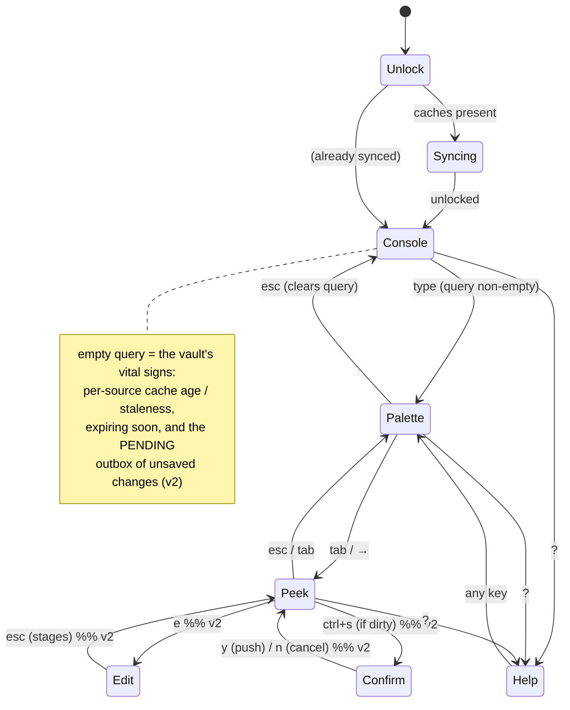

# harmos TUI — interaction contract

The state machine and keymap `teatest` verifies in M5. It tests the contract, not
the colors. Grounded in the M4 prototype (`scratch/prototype/`).

The model: **one surface with a fast heart and depths, not four screens.** Launch
lands you in the search. An empty query is the Console home. Typing is the
Palette. Peek expands the selection into detail. Editing (v2) drops into the
detail pane in place. Nothing is modal that doesn't need to be.

## States

- **Unlock / Syncing** are the entry states (spec §7): one master-password prompt
  opens all caches; a slow sync shows real progress (52 MB / ~76 s).
- **Console** — empty query. Vault vitals up front: which source is stale, what's
  expiring, and (v2) the pending-push outbox.
- **Palette** — the default working state. Live-ranked results; each row shows
  **source + freshness** so a wrong-source copy is impossible to miss.
- **Peek** — the selected result expanded into rich detail (Split when ≥100 cols:
  list left, detail right; a detail screen when narrower).
- **Edit / Confirm** (v2) — editing happens **in the detail pane in place** (the
  cursor moves right; the list stays left). Edits **stage** (`● unsaved`); a
  separate **push** shows a diff + the fully-qualified target and is never an
  automatic merge (spec §3).

## Keymap

| Key | Where | Action |
|---|---|---|
| *(type)* | Palette/Console | live search, no mode, no debounce |
| `↑` / `↓` (`ctrl+p`/`ctrl+n`) | Palette/Peek | move selection |
| `enter` | Palette/Peek | **copy password** + start the countdown |
| `tab` / `→` | Palette | peek: expand into detail |
| `esc` | Peek | back to Palette · from Console clears nothing |
| `esc` | Palette | clear the query → Console |
| `ctrl+u` / `ctrl+o` / `ctrl+y` | Palette/Peek | copy username / url / otp |
| `ctrl+r` | Peek | reveal / hide the password |
| `s` / `S` | Console/Palette | sync this source / all |
| `e` | Peek | **edit** the entry (v2) — cursor to the detail pane |
| `ctrl+s` | Peek (dirty) | **push** staged changes → confirm (v2) |
| `ctrl+t` | any | switch theme (brass ↔ charm) |
| `?` | any | toggle help |
| `ctrl+c` | any | quit (clears the clipboard) |

**Command vs type discipline:** in Palette/Console the surface is a search field —
letters type. In Peek the surface is a command mode — letters are commands. Copy,
reveal, edit, and push therefore use `enter`, `tab`, and `ctrl`-combos, never bare
letters that would collide with typing.

**Copy discipline (spec §8b):** `enter` copies immediately, no confirmation
dialog. The countdown line shows **what** was copied and the **fully-qualified
target** (`work · Infra · db-prod`) while the timer runs, so a wrong-source copy
is visible instantly and still fixable.

## Responsive contract (spec §8a)

| Width | Layout |
|---|---|
| ≥ 100 | Two-pane: results left, detail right (Peek is Split) |
| 60–99 | One pane; Peek is a detail *screen*, `esc` returns |
| 40–59 | Compact: columns drop from the right |
| < 40 or < 10 rows | Refuse: centered current-size / minimum message |

**Column-drop order** (from the right, M4 pick): `modified → tags → url →
username`. **Title and the source badge never drop.** URLs truncate in the
*middle*. The status line (cache age, profile) and the countdown are pinned; the
list flexes to `total − chrome`, recomputed on every `WindowSizeMsg`.

Non-TTY: `harmos ls` / `get` / `status` emit no ANSI; launching the TUI without a
TTY exits with a clear message.
